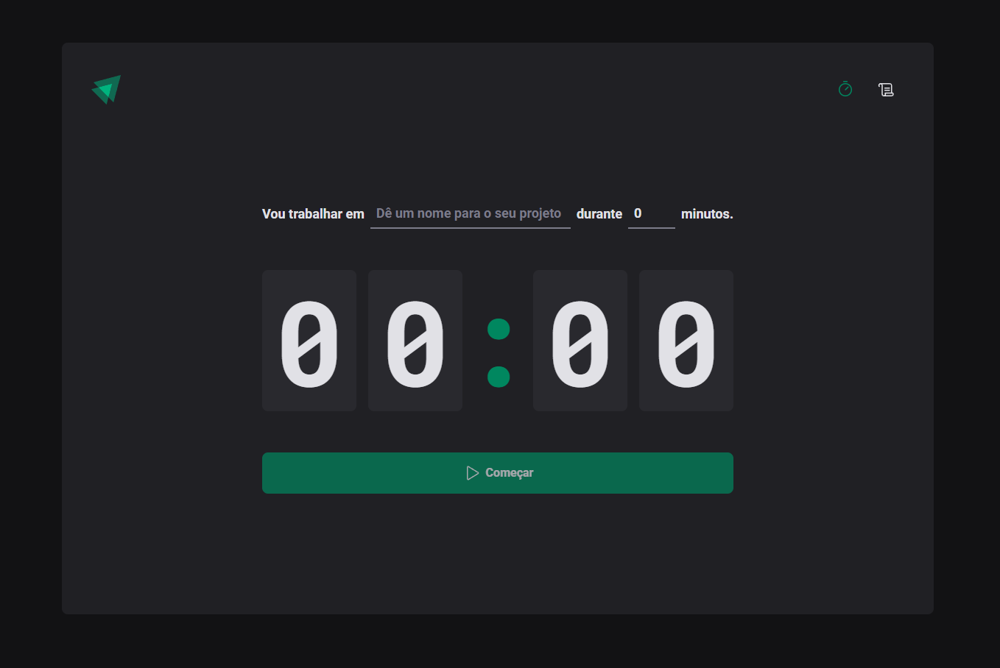

# Ignite Timer

 <br/> <br/>
 <br/> <br/>

## Funcionalidades da aplicação
- Criar/interromper timer
- Histórico de tarefas

## Tecnologias utilizadas
- React
- Vite
- React Router
- React Hook Form
- Styled Components
- PhosphorIcons
- date-fns
- Immer
- Zod

### Instalação
1. Clone o repositório:

```bash
git clone https://github.com/jlefilho/ignite-timer.git
```

2. Acesse a pasta do projeto:

```bash
cd ignite-timer
```

3. Instale as dependências:

```bash
npm install
```

4. Inicie o projeto:

```bash
npm run dev
```
